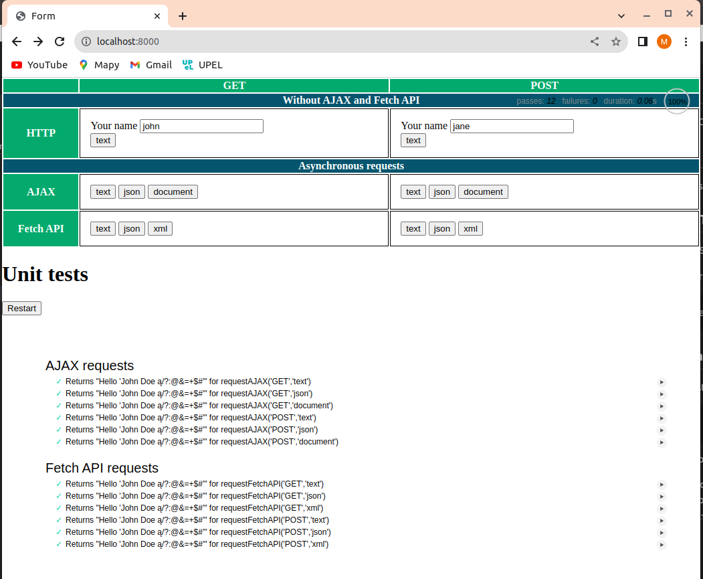

# JS-lab6
JavaScript course at AGH lab 6

## Overview
This project is node.js server application using express and pug packages.

## Packages and Tools
To run the project in VS Code, you will need following packages:
- express pug morgan entities

        npm install express pug morgan entities

## Server Application 1
Start your server as a standard node.js application from command-line:

    node ./app1.js

The server handles two routes:
- Route: GET "/" - displays UI
- Route: GET "/submit" - returns text/json/xml depending on `Accept` value in request header
- Route: POST "/submit" -  returns text/json/xml depending on `Accept` value in request header (same as GET /submit). `name` parameter is passed in request body (payload)

Example usage (open links in web browser)

    http://localhost:8000
    http://localhost:8000/submit?name=ala
    http://localhost:8000/submit?name=ola

Execute a POST using curl and passing `name` parameter in request body

    curl -X POST -d "name=ola" http://localhost:8000/submit
    curl -X POST -d "name=ola" http://localhost:8000/submit -H "Accept: application/json"
    curl -X POST -d "name=ola" http://localhost:8000/submit -H "Accept: application/xml"
    
## UI

## Tests 
Client tests are written using mocha.
They can be started in 2 steps (in 2 terminals):

    # start server
    node src/server_script1

    # start test script
    npx mocha

To run tests supertest package is required.

    npm install supertest --save-dev

## Optional Tools
- Code Runner

        code --install-extension formulahendry.code-runner

- eslint

        code --install-extension dbaeumer.vscode-eslint # installation
        npm init @eslint/config # configuration

        npx eslint --fix 'src/*.js' # execution
        npx jsdoc src --verbose # jsdoc generation

